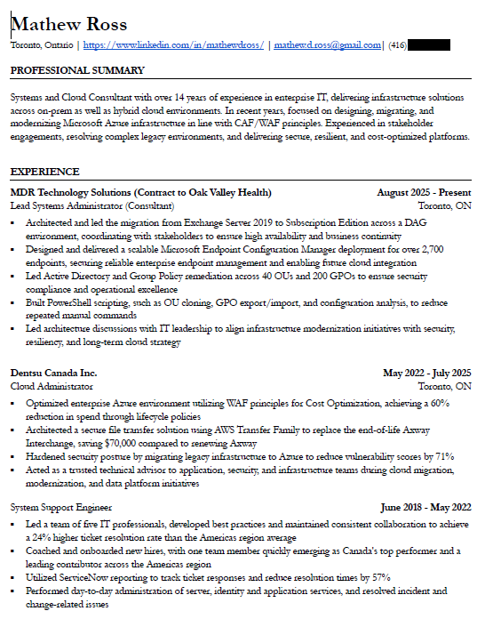

# Frontend Technical Notes

This section captures some of the original planning and evolution of the frontend as the project developed.

The site began as a **Cloud Resume Challenge implementation**, but eventually expanded into a personal portfolio and experimentation environment.

---

# Initial Goals

Original goals for the site included:

- ~~Create a static website that serves an HTML resume~~
- Create a website for projects, thoughts, and technical notes
- Provide resume and contact details
- Use the site as a platform to experiment with:
  - cloud infrastructure
  - CI/CD pipelines
  - Terraform
  - frontend tooling

---

# Website Design Evolution

The design went through several iterations.

### Initial Concept

- React app scaffolded using **Vite**
- ~~Single page scrolling layout~~

### Current Structure

The site evolved into a **multi-page layout**:

- Home
- About
- Projects
- (Future: blog / posts)

Design decisions along the way:

- ~~Sidebar navigation~~
- ~~Header vs Sidebar~~
- Final design uses a **header-based navigation**

Other considerations:

- Mobile layout improvements
- Expand the Home page with latest projects/posts
- Maintain consistent formatting across posts and projects
- Create placeholders for projects and posts to maintain layout consistency
- Utilize Markdown on Posts and Projects
- ScrollToTop component

---

# Resume Format Considerations

The original resume format was based on the **Harvard resume template**.

The goal was to maintain a similar structure for presenting experience and projects on the website.

# Local Development

Run the development server:

cd frontend
npm install
npm run dev

The site will be available at:

http://localhost:5173

